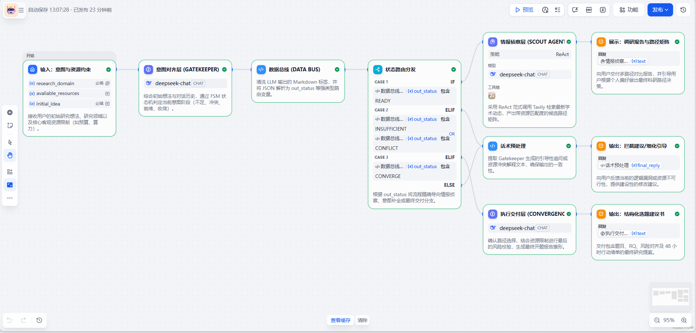

# 科研选题副驾系统 (Research Topic Co-pilot) 🚀

> **一套基于 Dify 的多智能体科研辅助工作流，利用漏斗架构实现从“模糊想法”到“高质量开题提案”的决策闭环。**

---

## 📖 产品需求文档 (PRD) 概览

本项目不仅是一个技术 Demo，更是一套严谨的 AI 产品方案。你可以 [**点击此处查看详细 PRD 全文**](./PRD.md)。

### PRD 核心设计要点：
* **目标用户**：处于开题迷茫期的 **科研新手**（如高年级本科生、研一新生）。
* **漏斗模型**：采用“意图对齐层 (Gatekeeper) -> 情报侦察层 (Scout) -> 执行交付层 (Convergence)”的三层漏斗架构。
* **硬性约束**：系统强制关联用户输入的 `available_resources`（如：10万预算、特定硬件），进行方案的可行性过滤。
* **评估方案**：通过“意图收敛率”和“选题存活率”量化系统对科研决策的实际帮助。

---

## 🌟 技术亮点 (Technical Highlights)

* **FSM 状态机路由**：系统底层通过 Python 节点解析 LLM 输出的状态码（`INSUFFICIENT`, `CONFLICT`, `READY`, `CONVERGE`），实现非线性流程的精准控制。
* **上下文感知决策**：开启 Session Memory（对话记忆），使系统能够识别用户在多个路径对比后的“收敛意图”（例如识别输入：“我选路径2”）。
* **数据解耦设计**：通过专用的数据总线（Data Bus）节点清洗 JSON 标签，确保 LLM 的非结构化输出能稳定驱动后端业务路由。

---

## 🏗️ 工作流架构 (Architecture)

本架构通过“发散（检索调研）”与“收敛（决策交付）”的循环，确保最终输出的选题既具备前沿性，又具备工程落地性。

---

## 🚀 如何在本地运行 (Quick Start)

### 1. 环境准备
* 确保你拥有 [Dify.ai](https://dify.ai/) 账号（云端或私有化部署均可）。
* 准备好以下 API Keys：
    * **LLM Provider**: OpenAI 或 DeepSeek (推荐)。
    * **Search Tool**: [Tavily Search](https://tavily.com/) API Key。

### 2. 导入工作流 (DSL Import)
1.  下载本仓库 `workflow/` 目录下的 [**research-topic-copilot.yml**](./workflow/research-topic-copilot.yml) 文件。
2.  进入 Dify 控制台，点击 **“创建应用” (Create App)** -> **“导入 DSL 文件” (Import DSL File)**。
3.  上传刚才下载的 `.yml` 文件。

### 3. 配置节点
1.  进入工作流编排界面。
2.  在 **意图对齐层 (Gatekeeper)** 和 **执行交付层 (Convergence)** 节点中，配置你的 LLM 模型。
3.  在 **Scout Agent (情报侦察层)** 节点中，填入你的 **Tavily API Key**。

---

## 📄 核心逻辑定义 (Logic Definition)

系统通过以下状态驱动路由转向，拦截无效需求，聚焦高价值决策：
* `INSUFFICIENT`: 想法太泛，触发导师追问。
* `CONFLICT`: 资源不匹配，触发平替建议。
* `READY`: 意图清晰，触发学术情报检索。
* `CONVERGE`: 识别到用户选择，触发最终报告生成。

---

## 📜 许可证与作者 (License & Author)

* **License**: [MIT License](./LICENSE)
* **Author**: [tian415](https://github.com/tian415)

---
